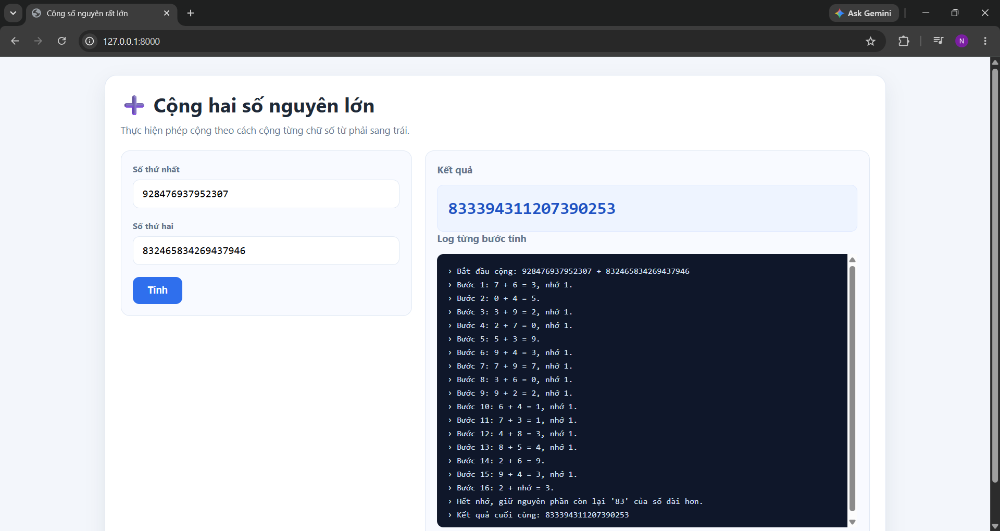

# Add2Num

Web app cộng hai số nguyên rất lớn theo cách tiểu học (cộng từng chữ số từ phải sang trái, có nhớ), có ghi log chi tiết từng bước tính.

## Cấu trúc project

```
Add2Num/
├── .github/workflows/
│   └── unit-test.yml     # GitHub Actions chạy unit test khi có PR vào main
├── main.py              # FastAPI app (route "/" trả HTML, "/calculate" xử lý API)
├── requirements.txt      # Thư viện cần cài
├── tests/
│   ├── test_core.py        # Unit test cho core/big_number.py
│   └── test_api.py         # Unit test cho API trong main.py
├── static/
│   └── index.html         # Giao diện web (HTML + CSS + JS)
└── core/                  # Đây là submodule link tới branch 'core'
    └── big_number.py       # Logic cộng số lớn (class MyBigNumber)
```

## 1. Cài đặt requirements

Yêu cầu Python (gợi ý 3.12).

Khuyến khích tạo virtual environment trước khi cài:

```powershell
python -m venv venv
venv\Scripts\activate
```

Cài các thư viện cần thiết:

```powershell
pip install -r requirements.txt
```

## 2. Chạy Unit Test

Project có 2 bộ unit test nằm trong thư mục `tests/`, đều chạy độc lập từ thư mục gốc project và in kết quả ra console:

| File | Kiểm tra |
|---|---|
| `tests/test_core.py` | Logic cộng số lớn (`MyBigNumber`) |
| `tests/test_api.py` | API trong `main.py`: `GET /` và `POST /calculate` (kết quả, log, lỗi 400/422) |

### 2.1. Test phần core

```powershell
python tests/test_core.py
```

### 2.2. Test phần API

Test dùng `TestClient` của FastAPI (cần thư viện `httpx`, đã có trong `requirements.txt`), không cần bật server.

```powershell
python tests/test_api.py
```

### 2.3. Chạy tất cả test

```powershell
python tests/test_core.py
python tests/test_api.py
```

Kết quả mong đợi: mỗi test case hiển thị 1 dòng log riêng, kết thúc bằng `OK` nếu tất cả pass.


## 3. Deploy / chạy web app

Chạy server bằng Uvicorn từ thư mục gốc project (`main.py` import `core.big_number`, nên phải chạy tại đây):

```powershell
uvicorn main:app --host 127.0.0.1 --port 8000
```

Sau đó mở trình duyệt tại:

```
http://127.0.0.1:8000
```

Nhập hai số nguyên không âm và bấm **Tính** để xem kết quả cùng log từng bước cộng.

Log xử lý (từng bước cộng) sẽ được in ra console của server, đồng thời trả về kèm trong response API `/calculate`.

## 4. Demo


